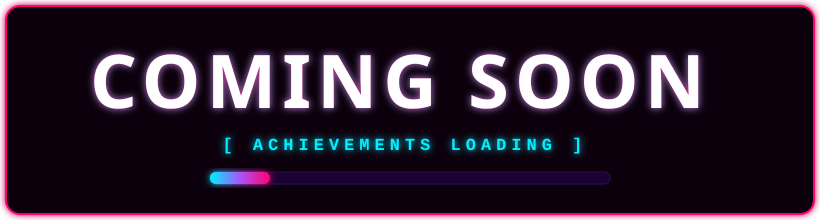
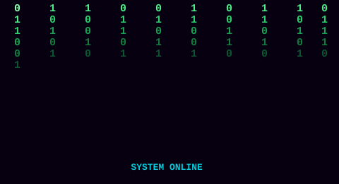

<!-- ═══════════════════════════════════════════════════════════════════════════════ -->
<!-- 🌌 ERICK SEBASTIÁN ERAZO RODRÍGUEZ — CYBERPUNK PROFILE README                  -->
<!-- ═══════════════════════════════════════════════════════════════════════════════ -->

<!-- HEADER: FONDO SYNTHWAVE ANIMADO (SVG propio) + TÍTULO -->
<div align="center">


<a href="https://github.com/Ericks16">
  
</a>

<a href="https://github.com/Ericks16">
  
</a>

<br/>


<br/><br/>

<!-- MASCOTAS: EQUIPO POKÉMON ANIMADO -->
&nbsp;&nbsp;&nbsp;&nbsp;&nbsp;
&nbsp;&nbsp;&nbsp;&nbsp;&nbsp;
&nbsp;&nbsp;&nbsp;&nbsp;&nbsp;
&nbsp;&nbsp;&nbsp;&nbsp;&nbsp;
&nbsp;&nbsp;&nbsp;&nbsp;&nbsp;


<br/>
<sub><i>「 Gotta commit 'em all 」</i></sub>

</div>

<!-- GATITO PIXEL QUE CAMINA, DUERME Y DESPIERTA -->
<div align="center">

</div>


<!-- ═══════════════════════════════════════════════════════════════════════════════ -->
<!-- WHOAMI + SKILLSET                                                               -->
<!-- ═══════════════════════════════════════════════════════════════════════════════ -->

<table>
<tr>
<td width="50%" valign="top">

## `>_ WHOAMI`

```typescript
const developer: SoftwareEngineer = {
  name: "Erick Sebastián",
  surnames: "Erazo Rodríguez",
  alias: "@Ericks16",

  location: "Quito, Ecuador",
  university: "EPN — Best in Ecuador",
  career: "Software Engineering",
  semester: 7,

  languages: {
    spanish: "Native",
    english: "C1"
  },

  status: "Available",
  motto: "Build the future."
};
```

</td>
<td width="50%" valign="top">

## `>_ SKILLSET`

<div align="center">


<br/>


<br/><br/>


</div>

</td>
</tr>
</table>

<!-- ═══════════════════════════════════════════════════════════════════════════════ -->
<!-- WHAT I DO — 3 TARJETAS                                                          -->
<!-- ═══════════════════════════════════════════════════════════════════════════════ -->

<div align="center">

## `>_ WHAT_I_DO.exe`

<table>
<tr>
<td align="center" width="33%">

<br/><br/>
<b>FRONTEND</b>
<br/>
<sub>Building beautiful, performant web experiences with React, Angular & TypeScript</sub>
</td>
<td align="center" width="33%">

<br/><br/>
<b>WEB 3.0</b>
<br/>
<sub>Smart contracts, dApps, blockchain integration with Solidity & Ethers.js</sub>
</td>
<td align="center" width="33%">

<br/><br/>
<b>AI & AUTOMATION</b>
<br/>
<sub>Process automation, LLM integration, intelligent workflows</sub>
</td>
</tr>
</table>

</div>


<!-- ═══════════════════════════════════════════════════════════════════════════════ -->
<!-- TECH ARSENAL                                                                    -->
<!-- ═══════════════════════════════════════════════════════════════════════════════ -->

## `>_ TECH_ARSENAL`

<div align="center">


<br/>


<br/><br/>


<br/>


<br/><br/>


<br/>


<br/><br/>


<br/>


<br/><br/>


<br/>


</div>


<!-- ═══════════════════════════════════════════════════════════════════════════════ -->
<!-- GITHUB STATS                                                                    -->
<!-- ═══════════════════════════════════════════════════════════════════════════════ -->

## `>_ NEURAL_STATS.dat`

<div align="center">

<table>
<tr>
<td>

</td>
<td>

</td>
</tr>
</table>


<br/><br/>


</div>


<!-- ═══════════════════════════════════════════════════════════════════════════════ -->
<!-- SNAKE + PAC-MAN — MASCOTAS QUE RECORREN EL MAPA                                 -->
<!-- ═══════════════════════════════════════════════════════════════════════════════ -->

<div align="center">

## `>_ CONTRIBUTION_SNAKE.exe`

<picture>
  <source media="(prefers-color-scheme: dark)" srcset="https://raw.githubusercontent.com/Ericks16/Ericks16/output/github-snake-dark.svg" />
  <source media="(prefers-color-scheme: light)" srcset="https://raw.githubusercontent.com/Ericks16/Ericks16/output/github-snake.svg" />
  
</picture>

<br/><br/>

## `>_ PACMAN_MAP.exe`

<sub><i>Pac-Man devorando todo mi mapa de contribuciones</i></sub>

<br/>

<picture>
  <source media="(prefers-color-scheme: dark)" srcset="https://raw.githubusercontent.com/Ericks16/Ericks16/pacman/pacman-contribution-graph-dark.svg" />
  
</picture>

</div>


<!-- ═══════════════════════════════════════════════════════════════════════════════ -->
<!-- ACHIEVEMENTS                                                                    -->
<!-- ═══════════════════════════════════════════════════════════════════════════════ -->

<div align="center">

## `>_ ACHIEVEMENTS.unlocked`



</div>


<!-- ═══════════════════════════════════════════════════════════════════════════════ -->
<!-- MATRIX METRICS — LLUVIA DE CÓDIGO SVG ANIMADA                                   -->
<!-- ═══════════════════════════════════════════════════════════════════════════════ -->

<div align="center">

## `>_ MATRIX_METRICS.json`

<table>
<tr>
<td width="50%" valign="top">



<div align="center">
<b>SYSTEM RUNNING</b>
<br/>
<sub>Compiling the future, one commit at a time</sub>
</div>

</td>
<td width="50%" valign="top">

```yaml
currently_learning:
  - Advanced React Patterns
  - Smart Contract Security
  - LLM Engineering
  - Web3 Architecture

building_now:
  - Decentralized Portfolio
  - AI-Powered Tools
  - Frontend Components

goals_2026:
  - Master DApp Development
  - Contribute to Open Source
  - Land Frontend Internship
  - Build SaaS Products

fun_fact: "I debug with coffee"
```

</td>
</tr>
</table>

</div>


<!-- ═══════════════════════════════════════════════════════════════════════════════ -->
<!-- DAILY QUOTE                                                                     -->
<!-- ═══════════════════════════════════════════════════════════════════════════════ -->

<div align="center">

## `>_ DAILY_TRANSMISSION.log`


</div>


<!-- ═══════════════════════════════════════════════════════════════════════════════ -->
<!-- CONNECT                                                                         -->
<!-- ═══════════════════════════════════════════════════════════════════════════════ -->

<div align="center">

## `>_ ESTABLISH_CONNECTION.net`

<a href="https://www.linkedin.com/in/erick-erazo-05826a29a/">
  
</a>
<a href="mailto:erick.erazo2003@gmail.com">
  
</a>
<a href="https://github.com/Ericks16">
  
</a>
<a href="#">
  
</a>

</div>

<!-- ═══════════════════════════════════════════════════════════════════════════════ -->
<!-- FOOTER                                                                          -->
<!-- ═══════════════════════════════════════════════════════════════════════════════ -->

<div align="center">


</div>
